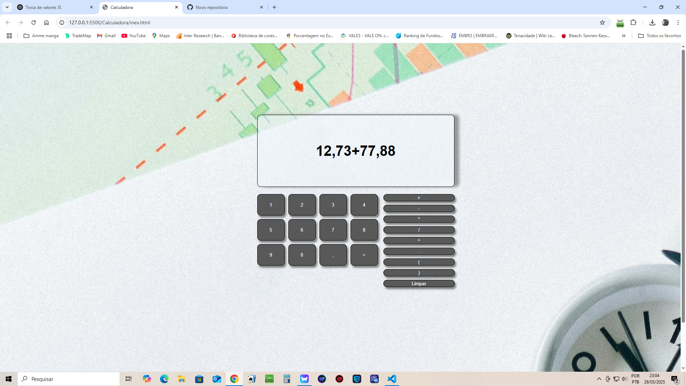

# 📱 Calculadora com Formatação Brasileira

Este é um projeto de calculadora simples desenvolvida em **JavaScript**, com formatação de números no **padrão brasileiro** (`1.234,56`). A calculadora permite fazer operações básicas, usa a biblioteca `math.js` para avaliação das expressões e trata erros comuns de forma inteligente.

---

## ✨ Funcionalidades

- ✅ Adição, subtração, multiplicação, divisão e exponenciação (`^`)
- ✅ Suporte a expressões com parênteses
- ✅ Reconhecimento de números no formato brasileiro (ex: `1.234,56`)
- ✅ Formatação do resultado com vírgula e ponto (`toLocaleString('pt-BR')`)
- ✅ Limpeza automática do campo após exibir resultado
- ✅ Tratamento de erros de sintaxe e expressões malformadas

---

## 🛠️ Tecnologias utilizadas

- HTML5
- CSS3 (grid layout para os botões)
- JavaScript (ES6+)
- [math.js](https://mathjs.org/) – biblioteca para cálculo de expressões matemáticas

---

## 📷 Exemplo

## 📌 Observações

Esta calculadora foi criada para fins de estudo e prática com JavaScript e regex.

Ainda não suporta raiz quadrada ou funções avançadas como `sen()`, `cos()`, `log()`, etc (mas pode ser facilmente expandida com `math.js`!).

---

## 🧠 Autor

Feito com 💻 por **[Guilherme Duarte da Silva]**  
Curso: Análise e Desenvolvimento de Sistemas  
Faculdade: [Anhanguera]

---

